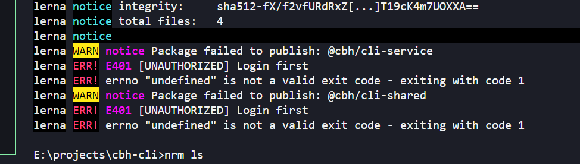

# 初始化项目

```
npm init -y
npm i -D lerna
npm i -g lerna # 可选
```

修改 package.json
```json
{
  "name": "cbh-cli",
  "version": "10.0.1",
  "description": "",
  "private": true,
  "main": "index.js",
  "workspaces": [
    "packages/*"
  ],
  "scripts": {},
  "keywords": [],
  "author": "",
  "license": "ISC",
  "devDependencies": {
    "lerna": "^8.2.0"
  }
}
```

# 初始化 lerna 配置

初始化 lerna 配置： `lerna init`

# 通过 lerna 创建包

```
lerna create @cbh/cli
```

# 通过 lerna 发布私有包

1. 首先，要有 git 提交
2. 然后执行，lerna publish

注意：需要项目下存在 .npmrc，否则可能会出问题（https://github.com/lerna/lerna/issues/2730）


```
registry=https://registry.npmmirror.com/
@cbh:registry=http://localhost:4873
```

# 通过 lerna 管理包的依赖

老版本用法： `lerna add <pkg> 要安装的包...`

新版本改动：https://lerna.js.org/docs/legacy-package-management


